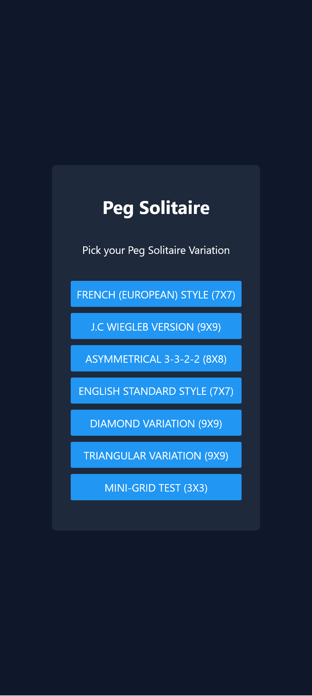
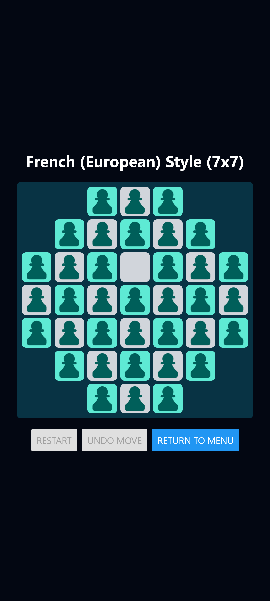
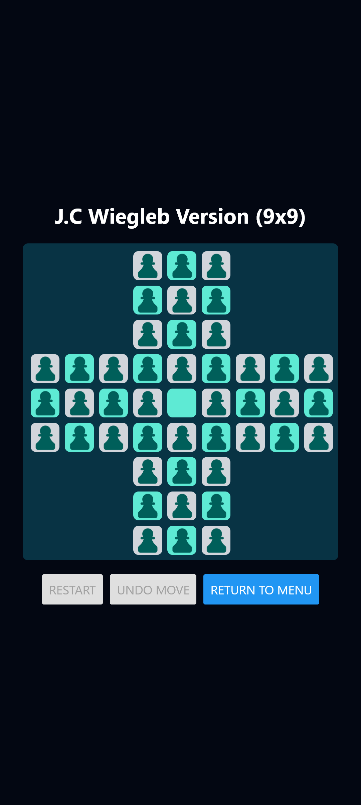
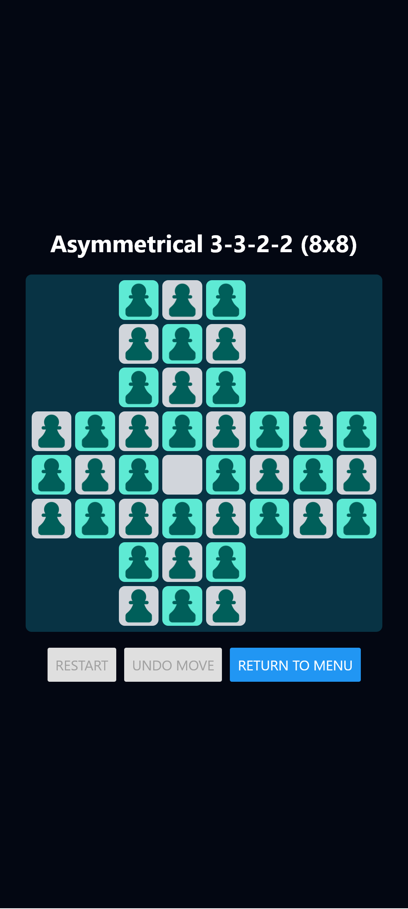
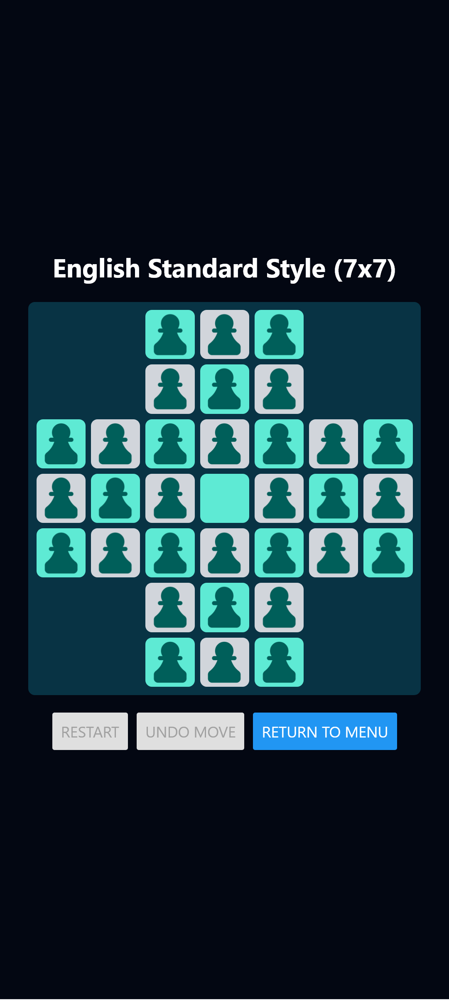
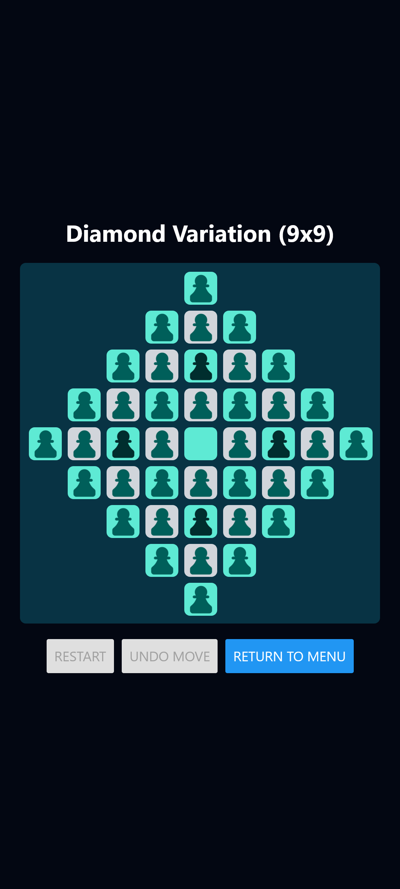
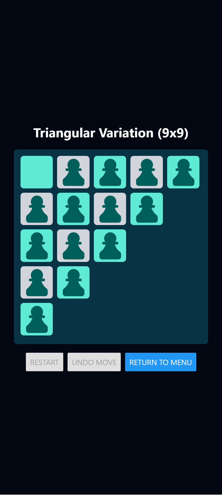
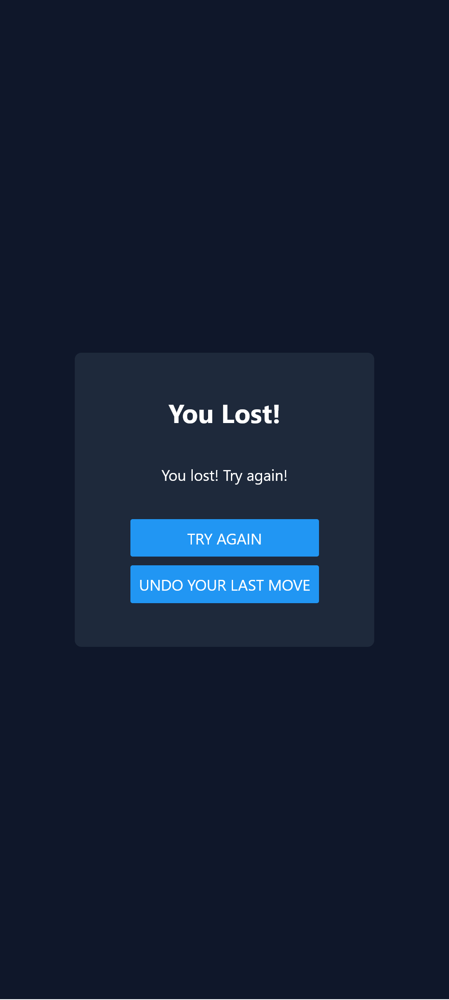
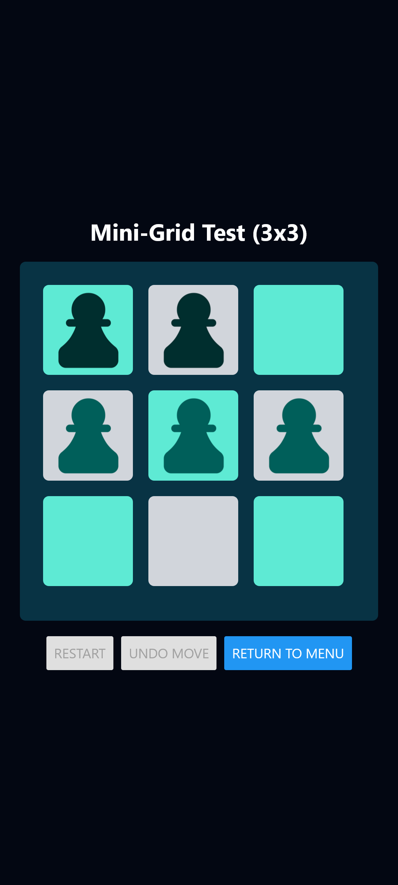

# PEG SOLITAIRE

A mobile application built with React Native and Expo
Coded by: Age Reapor

## Technologies

- React Native
- Expo
- NativeWind
- TypeScript

## INSTALLATION

To install the app, run `npm install` in the root directory, then run one of the following:

- `npx expo start --android`
- `npx expo start --web`
- `npx expo start --ios`

## GAMEPLAY

The player can pick one pawn called 'Peg' from the board. That peg can jump over another adjacent peg into an empty square called 'Hole,' getting rid of the other peg in the process. The goal of the game is to remove all Pegs aside from the last one standing. If there are more than one peg left that cannot move due to having no adjacent pegs, then the game is over.

To make things easier for the player, they are given Undo and Reset buttons.

The player gets to select the Peg Solitaire variation they want to play at the start of the game.

## SCREENSHOTS

### Main Menu

### French (European Style)

### J.C. Wiegleb Version

### Asymmetrical 3-3-2-2 Version

### Egnlish Standard Style

### Diamond Variation

### Triangle

### Win Screen

### Game Over Screen

### Test Mini Board

This was used for testing

